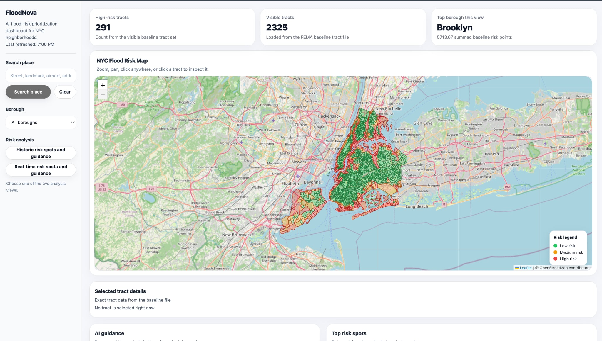
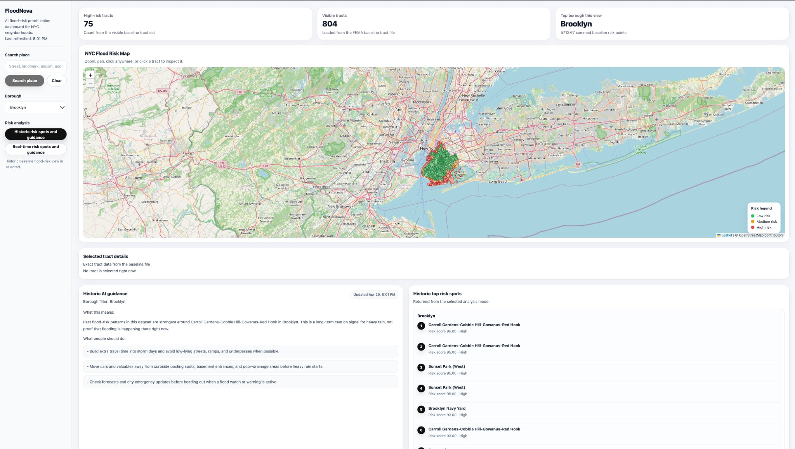
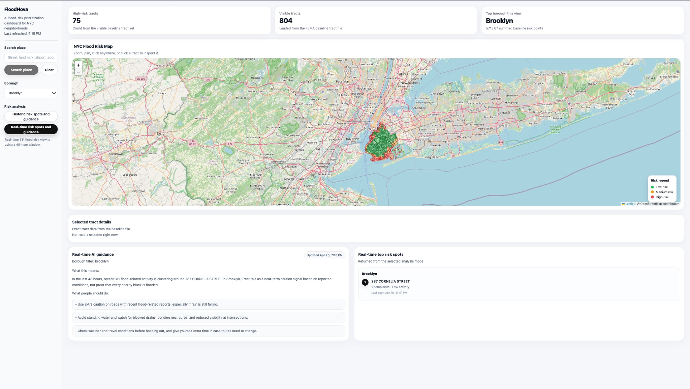

# AI-Integrated Flood Risk Management for NYC Neighbourhoods

## Overview

Flooding is becoming an increasingly serious challenge for many New York City neighborhoods, **especially in Brooklyn**, where low-lying and densely built communities often face recurring drainage problems, street flooding, and infrastructure strain during heavy rainfall. This project presents a research-oriented prototype dashboard designed to support flood risk understanding, neighborhood-level prioritization, and decision support through the integration of environmental, geographic, and public service data.

This repository contains the public-facing prototype of an AI-assisted dashboard that helps visualize historical flood risk and support data-informed interpretation of flood-related conditions in New York City, **with particular emphasis on Brooklyn neighborhoods**. The broader goal of the project is to demonstrate how data science, mapping, and AI-assisted guidance can be combined into a practical tool for identifying vulnerable areas, communicating local risk, and supporting future resilience planning.

## Research Purpose

The purpose of this project is to build a functional prototype that can serve as the foundation for a larger, implementable system for urban flood-risk awareness and neighborhood-level decision support. Rather than acting as a replacement for emergency systems or official forecasts, the dashboard is intended to show how multiple data sources can be combined into a single interface that is understandable, interactive, and useful for research, planning, and public-interest applications.

This work focuses on the question of how historical flood indicators, environmental context, and recent complaint-based signals can be integrated to identify areas of concern and present interpretable results through an accessible dashboard, **especially for Brooklyn communities that experience repeated flood-related vulnerability**.

## Project Goals

- Build a functional prototype for AI-assisted flood-risk visualization
- Identify and display neighborhood-level flood vulnerability patterns in NYC
- Place special emphasis on **Brooklyn neighborhoods and communities**
- Combine historical and environmental indicators into interpretable risk categories
- Support future development of real-time or near-real-time flood-related monitoring features
- Demonstrate how AI can help translate data outputs into understandable guidance
- Provide a research foundation for future implementation, expansion, and deployment

## What the Prototype Does

The current prototype is designed to:

- Display mapped flood-related risk patterns across NYC neighborhoods
- Highlight areas of concern, **especially in Brooklyn**
- Label areas based on relative flood vulnerability
- Support historic risk exploration through geographic visualization
- Integrate spatial and civic data into one decision-support interface
- Present AI-assisted interpretation or guidance based on analyzed patterns
- Help communicate which locations may deserve more attention during adverse conditions

Depending on the current build and connected data pipeline, the dashboard may include:
- historical flood risk views
- borough-level comparisons
- tract or area-based map interaction
- complaint-informed signals
- AI-generated guidance panels
- search and navigation features

## Why This Matters

Flooding is not only an environmental issue. It is also a public safety, infrastructure, housing, transportation, and equity issue. Many NYC communities experience recurring drainage problems, street flooding, and storm-related disruption, but these burdens are often felt sharply in **Brooklyn neighborhoods**, where dense development, aging drainage infrastructure, and local topographic conditions can increase vulnerability.

This project aims to address that gap by creating a unified prototype that can bring together relevant indicators and present them in a way that is useful for research, public-interest communication, and future resilience planning. It is especially relevant for **Brooklyn and other vulnerable NYC communities** where flood impacts can disrupt daily life, damage property, strain infrastructure, and create disproportionate burdens for residents.

## Dashboard Views

### Main Dashboard Overview


### Historic Risk Results


### Real-Time / Guidance View


> Note: The current image paths reflect the folder structure in this repository. If the image folder is later moved to `docs/images`, update the paths accordingly.

## Data Sources and Inputs

This prototype is informed by a combination of environmental, geographic, and civic data sources. Depending on the current stage of development, the project may draw from sources such as:

- FEMA flood hazard data
- elevation or terrain-related datasets
- precipitation records
- historical flood-related information
- NYC 311 complaint data
- geographic boundary files such as census tracts or neighborhood layers

These inputs are used to help identify relative flood vulnerability and support map-based interpretation, **with particular attention to areas in Brooklyn**.

## Prototype Methodology

At a high level, the project follows this logic:

1. Collect and prepare geographic and flood-relevant datasets
2. Standardize spatial units for mapping and comparison
3. Combine multiple indicators related to flood vulnerability
4. Generate relative risk categories or comparable priority signals
5. Visualize results through an interactive dashboard
6. Use AI-assisted outputs to translate patterns into readable guidance

The purpose of this approach is not to claim exact flood prediction for every block, but to produce a structured, interpretable, and scalable framework for flood-risk understanding, **especially for high-concern areas in Brooklyn and across NYC**.

## Technology Stack

This prototype uses a modern web-mapping and data application workflow. The public repository currently includes the frontend/dashboard portion of the system.

Likely technologies used in this prototype include:

- **React**
- **TypeScript**
- **Vite**
- **JavaScript / HTML / CSS**
- **GeoJSON-based map layers**
- **AI-assisted guidance or analysis integration**

Additional private or local development components may exist outside this public repository for security and development reasons.

## Repository Structure

```text
.
├── public/
├── src/
├── index.html
├── package.json
├── package-lock.json
├── vite.config.ts
├── tsconfig.json
├── tsconfig.app.json
├── tsconfig.node.json
├── eslint.config.js
└── README.md
